# CSE134B-WI25-HW1
# Name: Steve Padmanaban
# PID: A17054396

## **Part 1**  
**Question 1 Step 14:**
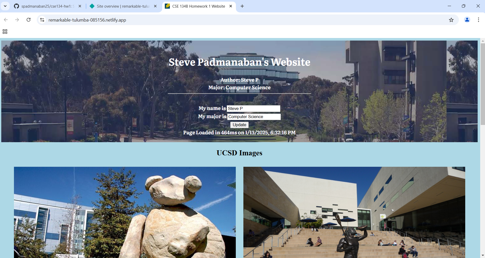  

**Question 1 Step 15:**  
Netlify site url: https://remarkable-tulumba-085156.netlify.app/    

**Question 2**
1. Number of Requests by Content Type:
    * Stylesheet - 1
    * Images/Icons - 11
    * Video/Media - 1
    * Script/JS - 1
    * Other/Miscellaneous (Font, Document, etc.) - 2

2. Total Number of Requests - 16
3. Total Bytes Sent - 6.8 MB

4. Waterfall Graph: 
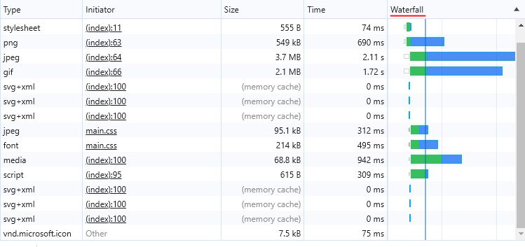   

**Question 3**
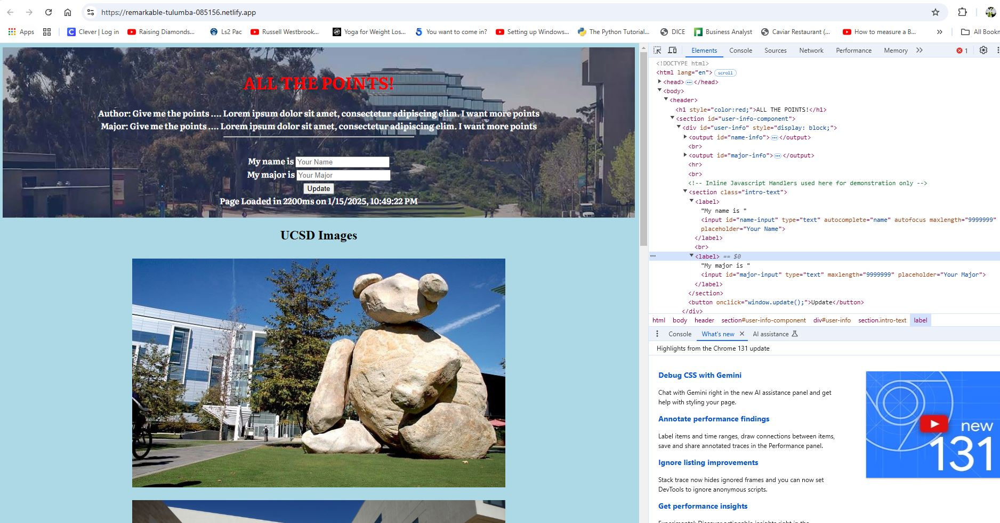   

## **Part 2**  
1. In the ESPN site, it took longer to find the **Top Headlines** due to the presence of many elements on the home page, so when pressing Tab, it would go all the way down a column of the page and go up the next column and repeat. This would repeat until I got to the last "column" of the page and the **Top Headlines** were located.   

2. In the webaim.org site, it was easier to navigate since there were few elements to go through with most of the focusable items being links to other webpages. This led to being able to find the information easily.    

## **Part 3**  

**Question 1**   
    
1. UCSD Response Headers:
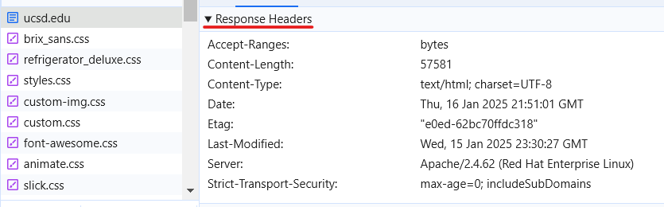   

2. UCI Response Headers:
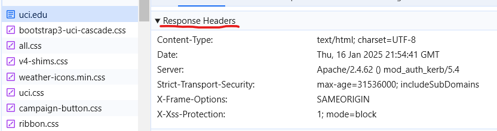   

3. In terms of server information, UCSD only lists the server name and version. However, UCI lists the name, version, and module details. This extra layer of disclosure makes UCI more vulnerable to security breaches.    

4. 
    | Data Type              | UCSD | UCI |
    | :---------------- | :------: | ----: |
    | Documents        |   0.97%   | 1.86% |
    | Stylesheets          |   41.93%   | 4.55% |
    | Scripts    |  10.17%   | 19.23% |
    | Fonts |  2.5%   | 3.5% |
    | Images |  43.54%  | 69.23%
  

**Question 2**   
UCSD:

Nothing really changed in the UCSD website. Everything remained the same with JavaScript disabled.  

Scripps:
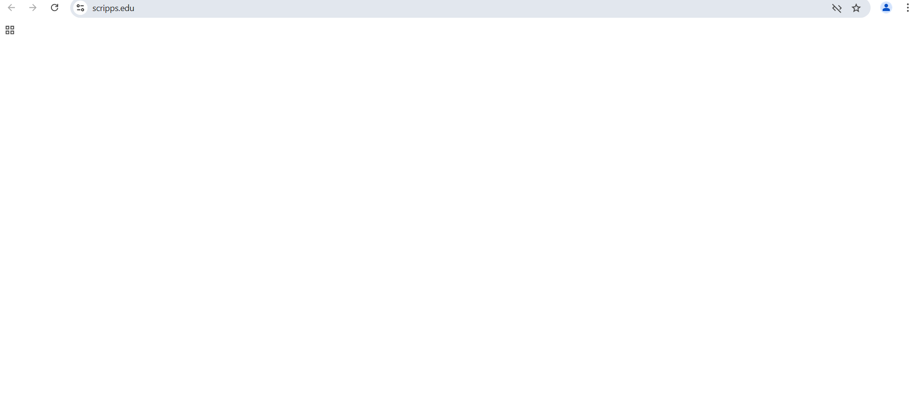
The entire Scripps website had disappeared. All the images, text, fonts had not appeared with JavaScript disabled.  

UCLA:

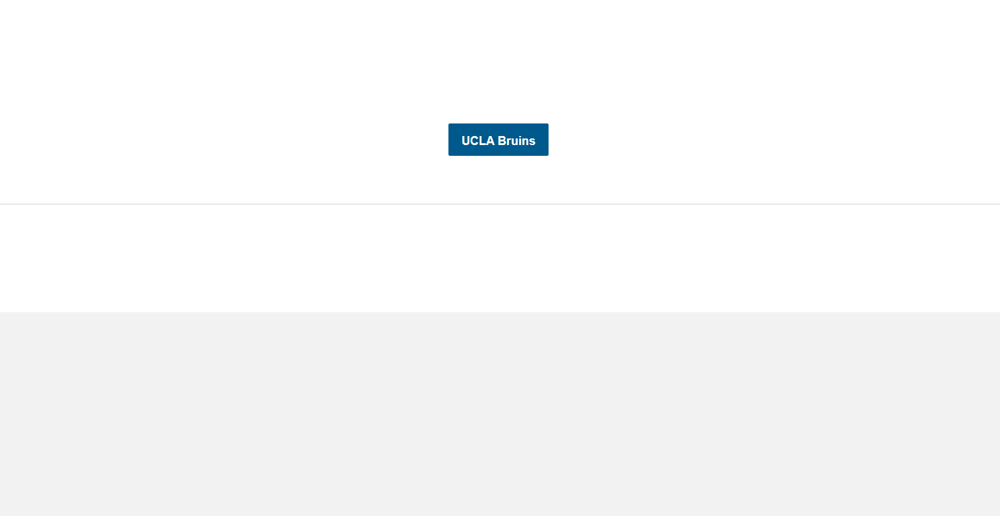
Portions of the UCLA website had disappeared including buttons to different webpages, images, and other texts with JavaScript disabled.   

**Question 3**  
1. CSUCI.edu has a custom 404 page.
2. https://www.csuci.edu/academics/structural_engineering
3. JPCatholic.edu does not have a custom 404 page.
4. https://jpcatholic.edu/academics/computer_science
5. Just like a default 404 page where the user is alerted that the page attemped to be accessed doesn't exist, a custom 404 does even more where it enhances the user experience and maintains the same design and aesthetics of the overall website.   

**Question 4**  
1. nytimes.com does have a robot.txt file:
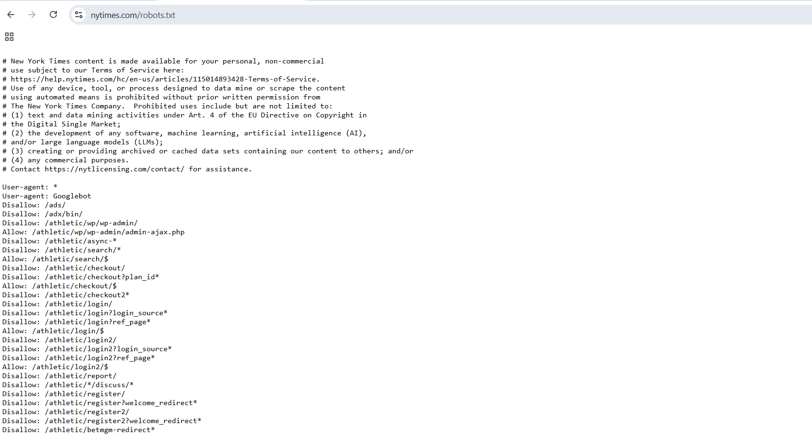  

2. A robot.txt file can disclose secure page paths of a website that isn't normally published. This can unintentionally help attackers easily access these pages.   

3. Based on the disallow rules placed in the robots.txt file, it implies that NYT is worried about AI crawlers. This is because companies like OpenAI and Apple have created AI crawlers to search through the site and collect content for training purposes. It is clear the NYT does not want such crawlers to use their content for training which is why they are not allowed access at all.   

**Question 5**  
1. Google Hacking is a technique that uses advanced searching in order to uncover hidden information on the Internet.   

2. If GoogleBot crawls malicious websites and retrieves data from them, it can update the overall Google Search Engine to store these types of file and data. A hacker perform Google Hacking would be able to retrieve these types of harmed files which could be troub**ling.   

3. Web Developers should be careful what data they post on their websites that are open to be crawled by GoogleBot. Moreover such sites should be secure, and a robots.txt should be considered to disallow GoogleBot if sensitive data/files are to be included in the website.    

4. As mentioned in the previous answer, a robots.txt file can disallow crawlers like AI or GoogleBot that collect information for training LLMs or search engines. This can avoid such data be retrieved by hackers via Google Hacking.   

**Question 6**  
1.   A. https://www.california.com/the-most-fun-things-to-do-around-uc-san-diego/   
B. https://piazza.com/   
C. https://www.bikeforums.net/southern-california/960967-great-news-all-you-san-diegans-who-cut-across-ucsd-during-rides.html   
D. https://news.ycombinator.com/item?id=579690   
E. https://www.ucd.ie/   
F. https://www.intedashboard.com/   
G. https://higher.education.narkive.com/Ce4pesFy/sdsu-or-ucsd-i-ve-gone-in-circles-1-000-times-i-just-need-a-best-guess-where-will-i-be-happiest-and-   
H. https://smashboards.com/threads/ucla-or-ucsd.162046/   
I. https://www.codepath.org/   
J. https://warren.ucsd.edu/_images/programs/WOAH/COMIC.pdf   

2. Using Bing to search this query, both Bing and Google provide similar results in which they show articles and forum posts about the advantage of attending UC San Diego. I prefer to use Google, mainly due to to user interface and the **People Also Ask** feature where I can see similar queries which serve as follow up questions based on the search results.    

**Question 7**  
1.  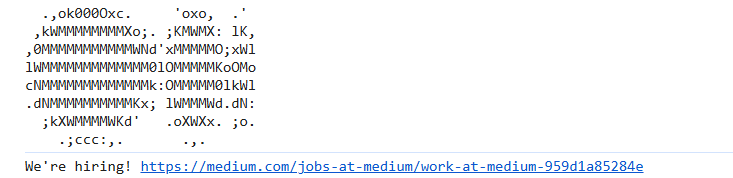  
2. Companies, like, Medium place these job links in order to target certain people they are looking for. In this case, the Javscript Console is usually accessed by those in the Computer Science field, so companies use this as a tactic to attract developers to apply to their listed roles.   
3.  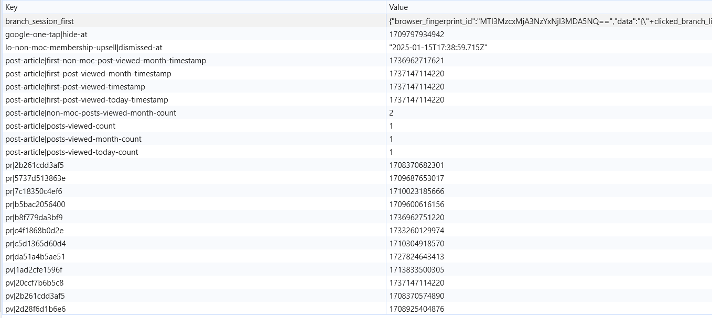 
Most of these values are timestamps used for times when a post 
was viewed or when was the first post viewed, etc. Counters like 
how many posts were viewed were a part of the local storage.   

**Question 8**  
1. The user interface of Google looks different with the agent header set to Iphone Google Chrome.   

2.  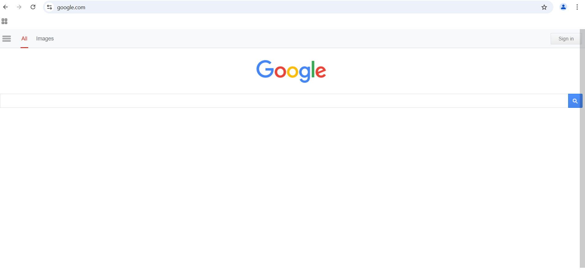 
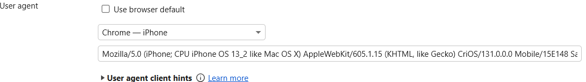   
Because Google receives an Iphone-related user agent header, it will display an Iphone interface of Google. This is because Google receives the origin of the request by analyzing the user agent header.   

**Question 9**  
* X-Render-Origin-Server: indicates original server that rendered the site

* X-Cache: corresponds to whether request came from cache

* X-Content-Type-Options: indicates that media types in content-type header should not be changed

* X-Jsd-Version: determines version of JSD

* X-Jsd-Version-Type: specifies type of JSD used

* X-Served-By: indicates specific server that handled request

* X-Frame-Options: determines if page can be displayed in frame related tag

* X-Github-Api-Version-Selected: indicates Github API version used for request

* X-Github-Media-Type: specifies media type for Github API response

* X-Github-Request-Id: identifer for request sent to Github server

* X-Ratelimit-Limit: indicates maximum number of requests that can be made

* X-Ratelimit-Remaining: shows remaining number of requests that can be made until reaching limit

* X-Ratelimit-Reset: time when rate limit will reset

* X-Ratelimit-Resource: specifies type of resource that will be limited

* X-Ratelimit-Used: displays number of requests already used in current window

* X-Xss-Protection: protects site from Xss attackers

* X-Permitted-Cross-Domain-Policies: determines whether site can be accessed cross-origin by document

* X-Download-Options: indicates how requested data can be downloaded

* X-Amz-Server-Side-Encryption: enables server-side encryption for Amazon S3 Object

* X-Connection-Hash: unique identifier for connection state

* X-Response-Time: indicates how long server processed request and sent response

* X-Transaction-Id: unique identifier for a transaction or chain of requests

* X-Request-Id: identifier for request

* X-Fastly-Request-Id: identifier for request processed by CDN   

**Question 10**  
1.  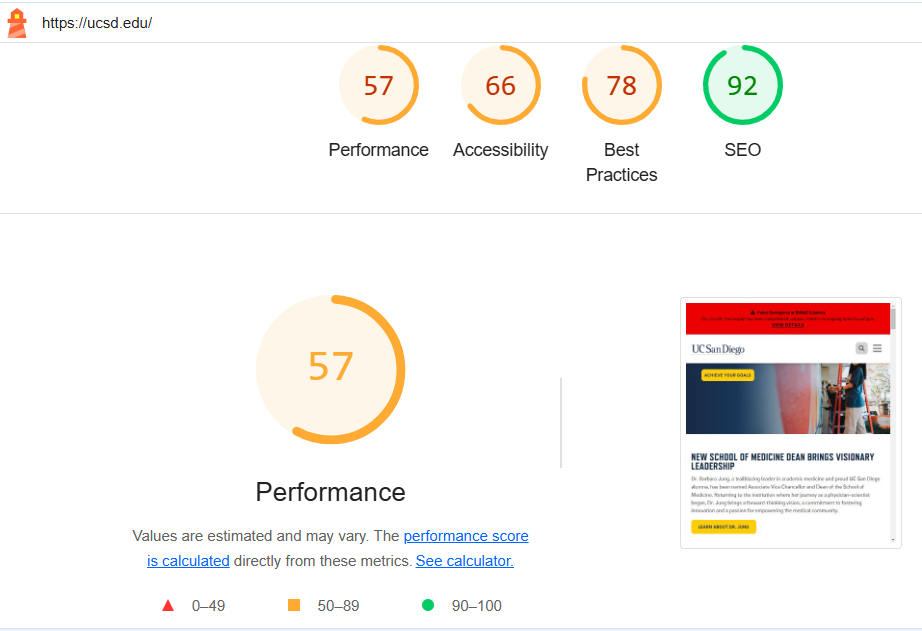  

2. Suggestions include eliminating render-blocking resources and reducing unused CSS. Eliminating these blocking resources allow the webpage to load faster without having to wait for large JS and CSS files to be downloaded in order to fully load. Removing unused CSS files extends the previous suggestion where the site would save data if it didn't need to load or defer loading unused CSS files.   

3.  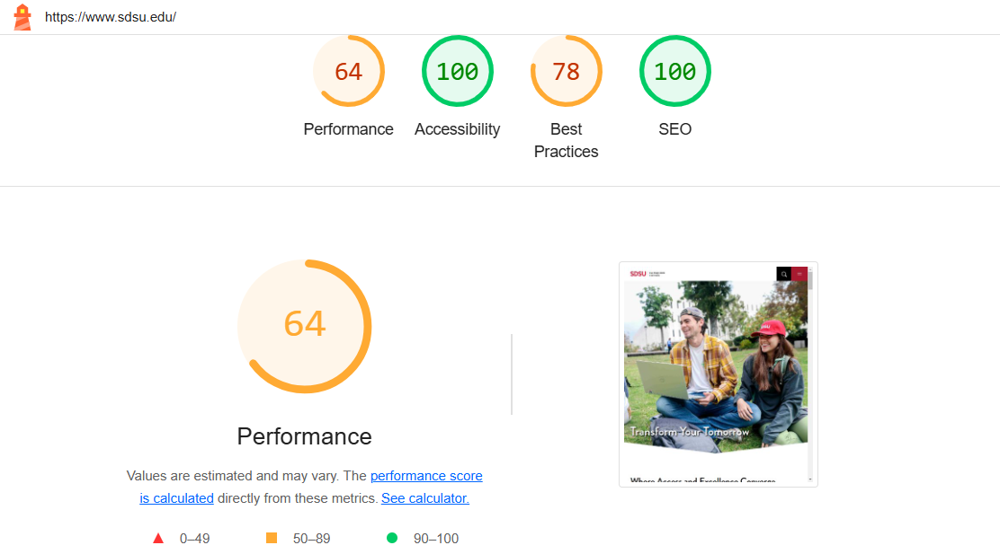  
SDSU had scored 64 on performance, 100 on accessibility, 78 on best practices, and 100 on SEO whereas UCSD scored 57 on performance, 66 on accessibility, 78 on best practices, and 92 on SEO.   

4. UCSD has more performance work to do with a score of 57 while SDSU had a score of 64.   

**Question 11**  

1. 
    * https://chromestatus.com/roadmap
    * https://status.services.mozilla.com/
    * https://github.com/MicrosoftEdge/Status
    * https://webkit.org/standards-positions/   

2. Chrome 53 introduced Shadown DOM v1.   

3. Shadow DOM v1 was introduced in Chrome 53 which was released on August 30, 2016.   

4. Google Chrome was released as to the public as stable on December 11, 2008.   

**Question 12**  
1.  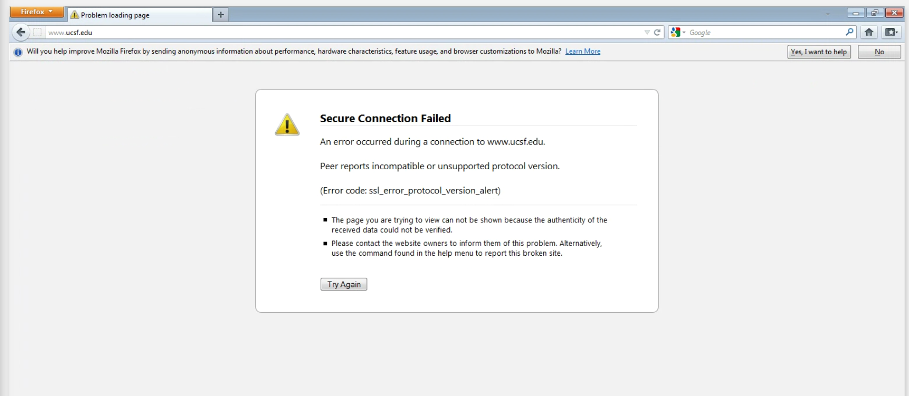   

2. Based on the screenshot above, it can be seen that one of the implications that a browser can support a site is if it has the compatible security protocols to load the site.   

**Question 13**  

1. The X-Content-Type-Options header is specifying **nosniff** for all of the requests that contain this response header. This indicates the browser to use the specified media type rather than a different one.  

2. A cloudflare server delivers services like DNS, CDN, and other types in order to make websites faster and more secure.   

**Question 14**  

1. There are 87 cookies on the UCSD homepage.   

2. There are 7 different domains shwon for UCSD cookies.   

3.  
    * .doubleclick.net
    * .google.com
    * .linkedin.com
    * .youtube.com
    * .myfonts.net
    * .ucsd.edu
    * .ipredictive.com   

4. There are 36 cookies on SDSU homepage.   

5. There are 12 different domains shown for SDSU cookies.   

6. 
    * www.sdsu.edu
    * www.clarity.ms
    * .doubleclick.net
    * .clarity.ms
    * .google.com
    * .youtube.com
    * sc-static.net
    * .sdsu.edu
    * 8a5e7a58-cf02-4302-a62b-bcc1af878097.rlets.com
    * .facebook.com
    * .snapchat.com
    * .simpli.fi    

## **Extra Credit**  

**Why SRI Matters**  
4. Subresource Integrity is important to have implemented in the web page so that the browser ensures the files it receives are not corrupted through the comparison of hash codes. This avoids from attackers stealing information.    

**Fixing The CSS**  
3. 
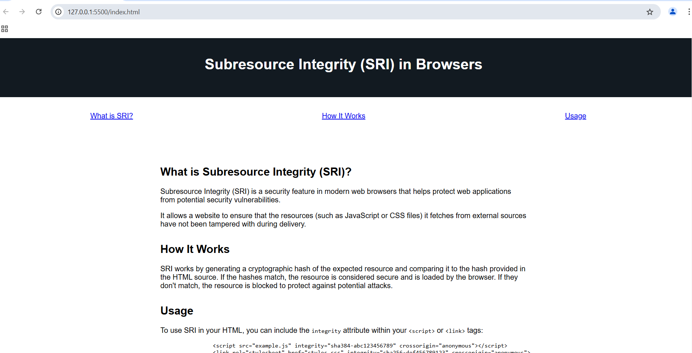   
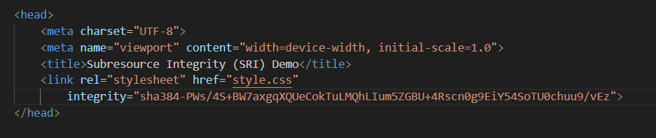   

**The Fickleness of the Client Side and DOM Manipulation**  
3. Script to Remove CSS Styling from sites.  
    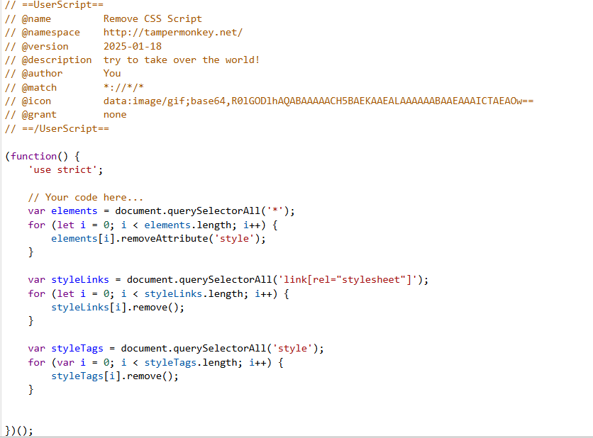   
    Script executed on NBA.com:  
    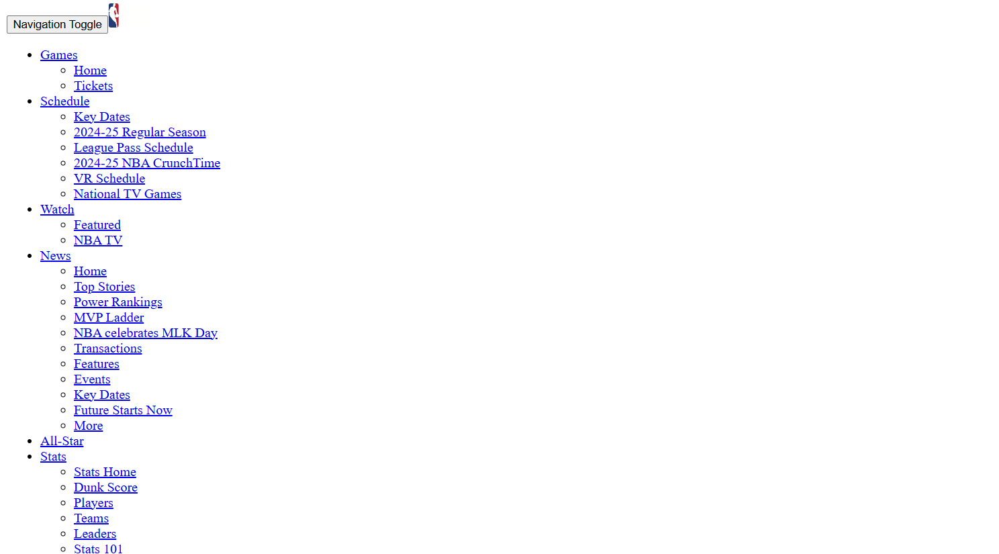   
    Script executed on UCSD.edu:  
    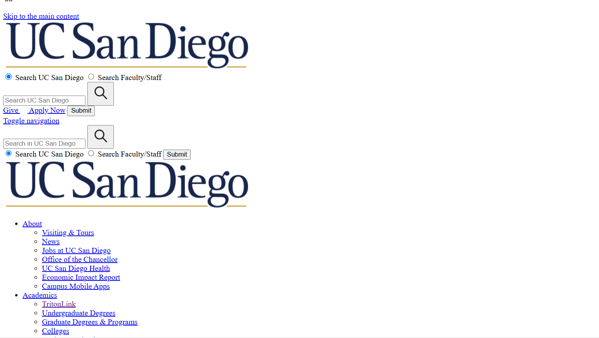   
4. The TamperMonkey Script that I developed removes 3 types
of CSS styling: inline, internal, or external.
For each type, I use document.querySelectorAll and loop through
each query element and remove it. Based on the UserScript, this
script will apply for all sites, regardless of domain. 

